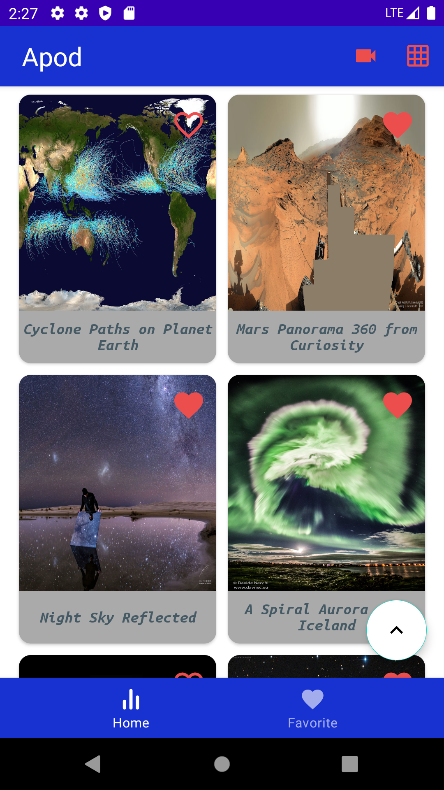
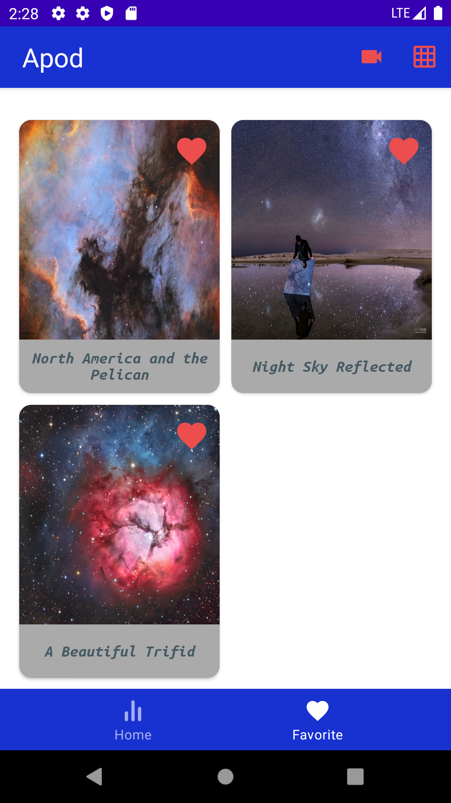
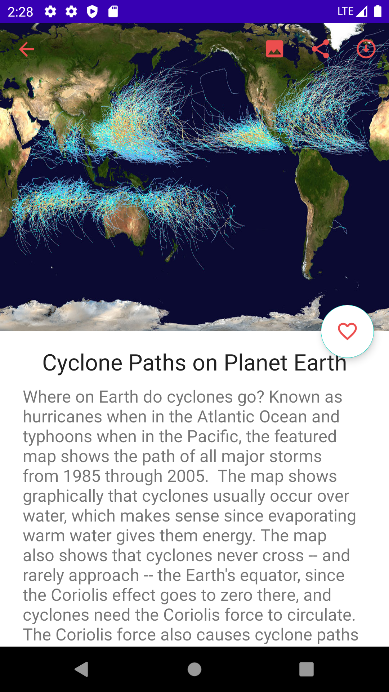
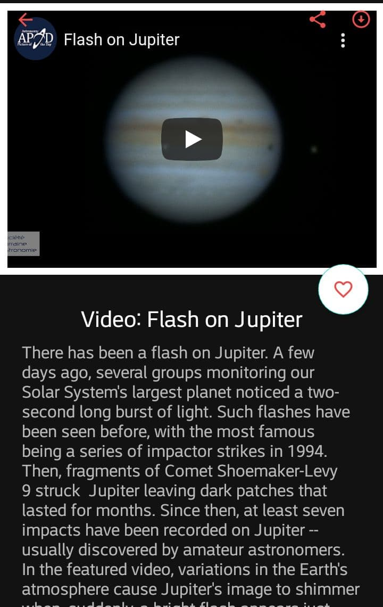
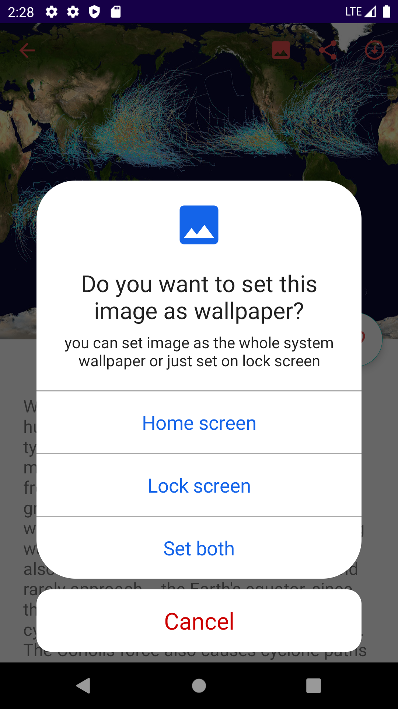
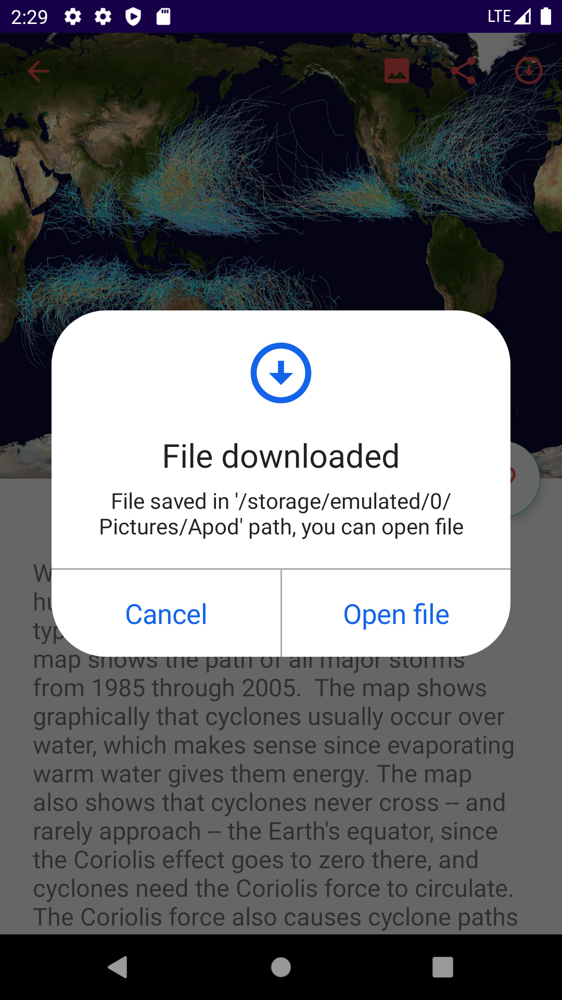
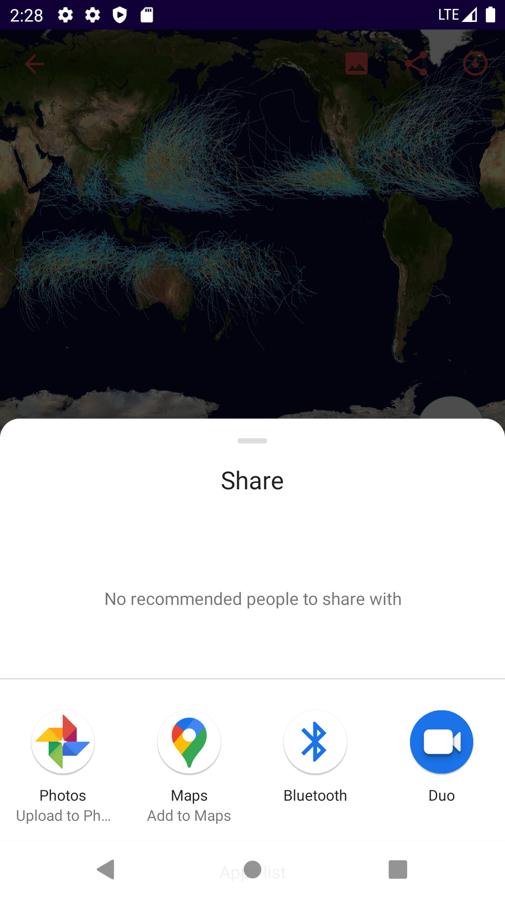
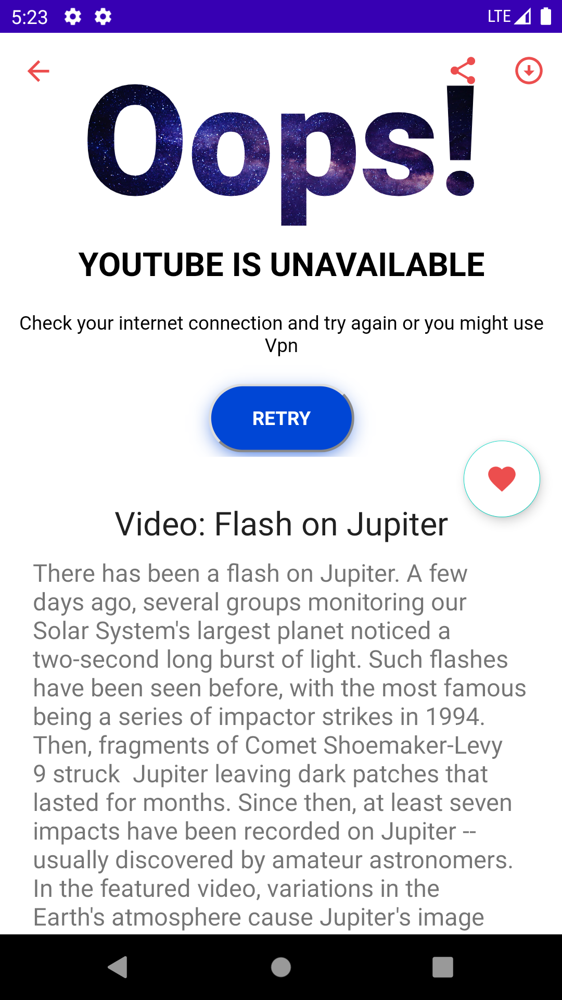

# Android Apod
An Android app to download the Nasa daily image and video 

## Table of content

* [Introduction](#Introduction)

* [Technologies](#Technologies)
 
* [Screenshots](#Screenshots)

* [App Gif](#App-Gif)

* [To Do](#To-Do)

## Introduction
 Nasa releases images and videos daily, and there is an API for that. This app uses that API to fetch photos and videos, and you can see an infinite list of them, watch videos, download images, set images as wallpaper, or choose your favorites. 

## Technologies 
* UI: Single activity, Fragments, Custom components, Animation, Lottie files
* Architecture: MVVM, Hilt, LiveData, Flow, Room, ViewModel, Paging, Navigation, Lifecycle, DataBinding, ViewBinding, Provider
* Third Libs: Retrofit, Picasso, Gson
* Foundation: Kotlin, AndroidX, AppCompat
* Behavior: Permission, DownloadManager, Sharing, Set Wallpaper, Swipe to refresh, Retry, ...

## Screenshot
<table  style="border: 1px solid black; width: 100%; word-wrap:break-word;
              table-layout: fixed; text-align:center" >
 <tr>
    <td align="center" valign="center">Home fragment</td>
     <td align="center" valign="center">Favorite fragment</td>
     <td align="center" valign="center">Image detail fragment</td>
      <td align="center" valign="center">Video detail fragment</td>
  </tr>
  <tr>
    <td align="center" valign="center"></td>
    <td align="center" valign="center"></td>
    <td align="center" valign="center"></td>
    <td align="center" valign="center"></td>
  </tr>
  <tr>
    <td align="center" valign="center">Set wallpaper dialog</td>
     <td align="center" valign="center">Open downloaded file dialog </td>
     <td align="center" valign="center">Share Image or video's link view</td>
      <td align="center" valign="center">YouTube unavailable and retry page</td>
  </tr>
  <tr>
    <td align="center" valign="center"></td>
    <td align="center" valign="center"></td>
    <td align="center" valign="center"></td>
    <td align="center" valign="center"></td>
  </tr>
 </table>

 ## App Gif

## To Do
 * Add setting page
      * Language 
      * Schedule changing wallpaper(via WorkManger)
 * Open videos in youtube
